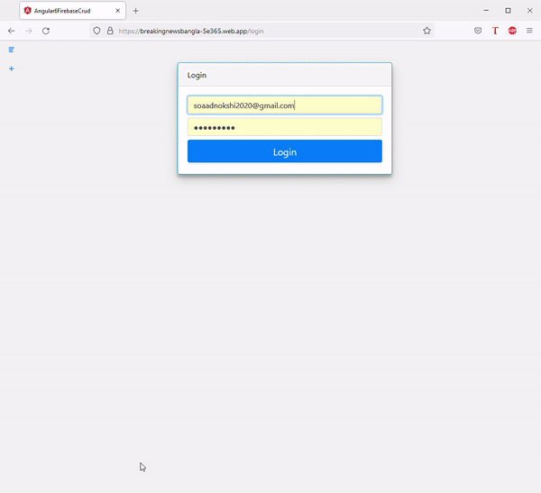
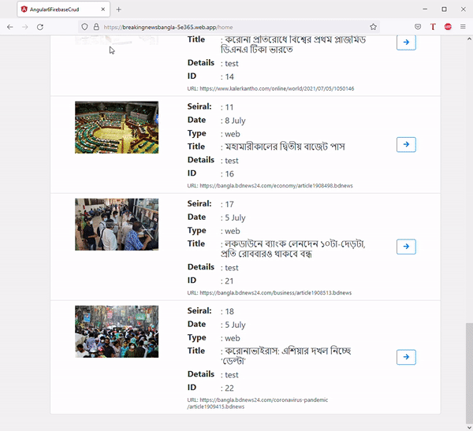

# # Breaking-news-app-admin-panel

This is an Angular web app project. [Live Link](https://breakingnewsbangla-5e365.web.app/)

## About

This SPA is the admin panel of the Android app "Everyday Top News" for updating data on the cloud server. Firebase is used as cloud server. User authentication is also done by firebase.  

  

## Development server

Run `ng serve` for a dev server. Navigate to `http://localhost:4200/`. The app will automatically reload if you change any of the source files.

## Build

Run `ng build` to build the project. The build artifacts will be stored in the `dist/` directory. Use the `--prod` flag for a production build.

## Alpha testing

For testing use the following test credentials. 
User ID: test@testmail.com 
Password: testPassword 
(Note that cloud update will not be successful for test user)

## Running unit tests

Run `ng test` to execute the unit tests via [Karma](https://karma-runner.github.io).

## License

[MIT](https://choosealicense.com/licenses/mit/)
